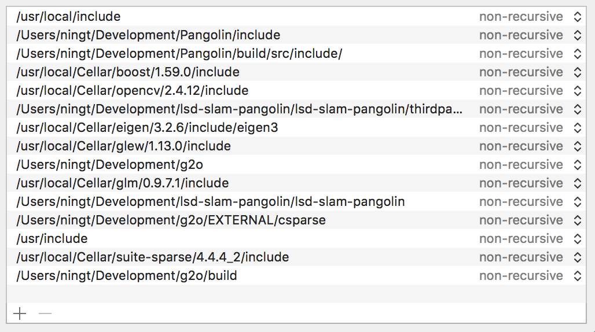
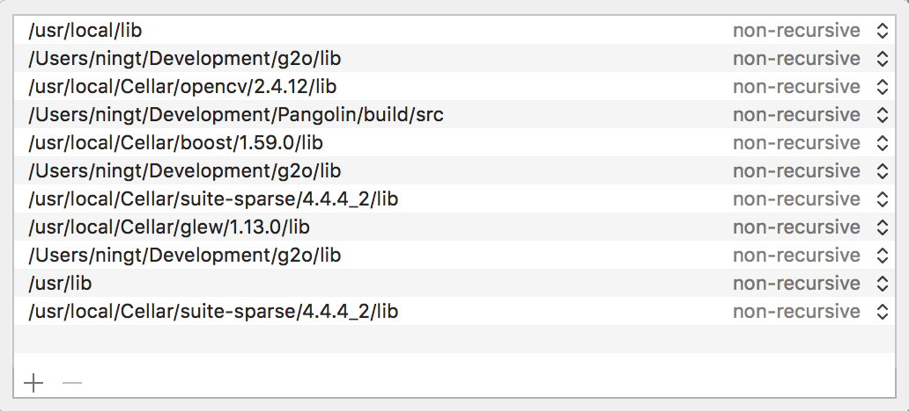
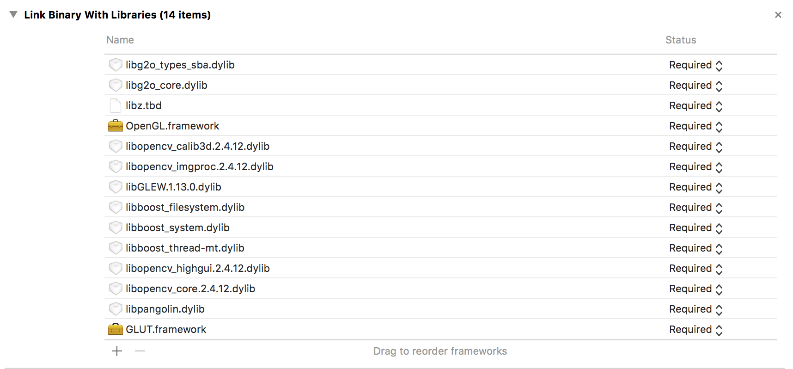

# LSD-SLAM: Large-Scale Direct Monocular SLAM

LSD-SLAM is a novel approach to real-time monocular SLAM. It is fully direct (i.e. does not use keypoints / features) and creates large-scale, 
semi-dense maps in real-time on a laptop. For more information see
[http://vision.in.tum.de/lsdslam](http://vision.in.tum.de/lsdslam)
where you can also find the corresponding publications and Youtube videos, as well as some 
example-input datasets, and the generated output as rosbag or .ply point cloud.

This fork contains a version that relieves the user of the horrors of a ROS dependency and uses the much nicer lightweight [Pangolin](https://github.com/stevenlovegrove/Pangolin) framework instead. 

### Related Papers

* **LSD-SLAM: Large-Scale Direct Monocular SLAM**, *J. Engel, T. Schöps, D. Cremers*, ECCV '14

* **Semi-Dense Visual Odometry for a Monocular Camera**, *J. Engel, J. Sturm, D. Cremers*, ICCV '13

# 1. Quickstart / Minimal Setup

- Install `boost glew glm libqglviewer suite-sparse eigen cmake opencv qt5` using 'brew'
- Follow the instructions to compile [Pangolin](https://github.com/stevenlovegrove/Pangolin) and [g2o](https://github.com/RainerKuemmerle/g2o)
- Update `build settings -> header search path & library search path`
- Update `build phases -> link binary with libraries`
- Copy `libg2o***.dylib & libpangolin.dylib` to `/usr/local/lib`

There are still a bit problem with g2o optimization, but at least can run it on Xcode.

# 3. Running

Supports raw PNG images. For example, you can down any dataset from [here](http://vision.in.tum.de/lsdslam) in PNG format, and run like;

./LSD -c ~/Mono_Logs/LSD_machine/cameraCalibration.cfg -f ~/Mono_Logs/LSD_machine/images/

# 4. License
LSD-SLAM is licensed under the GNU General Public License Version 3 (GPLv3), see http://www.gnu.org/licenses/gpl.html.
